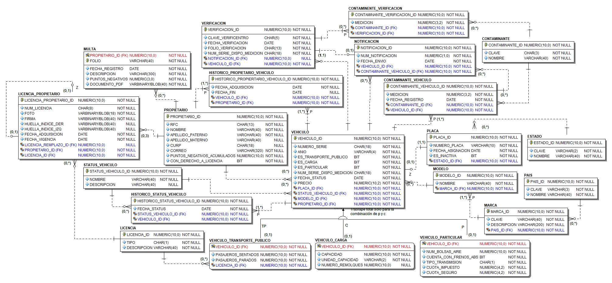

# CarControlOnlineDB 🚗💻 
**Proyecto final de bases de datos**

Consiste en la implementación de la metodología de diseño de bases de datos vista durante el curso para un caso de estudio. El proceso incluye todas las etapas de la metodología: análisis, diseño conceptual, diseño lógico y diseño físico.

## Descripción  
**CarControlOnlineDB** 
Car Control Online es una empresa de la inciativa privada que esta proponiendo un nuevo modelo al gobierno del pais para modernizar y mejorar el control vehicular del pais. La base de datos propone una serie de reglas de negocio descritas en el documento del caso de estudio, car-rontrol-online.pdf

